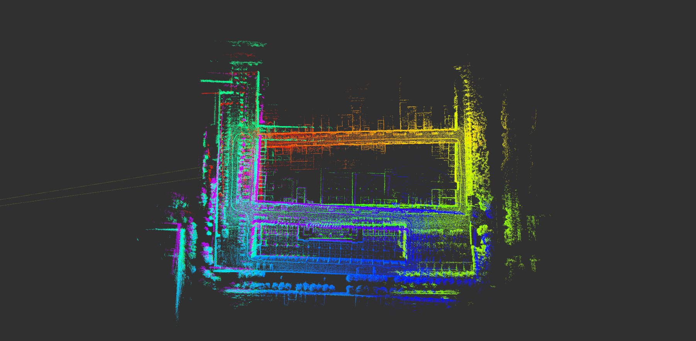
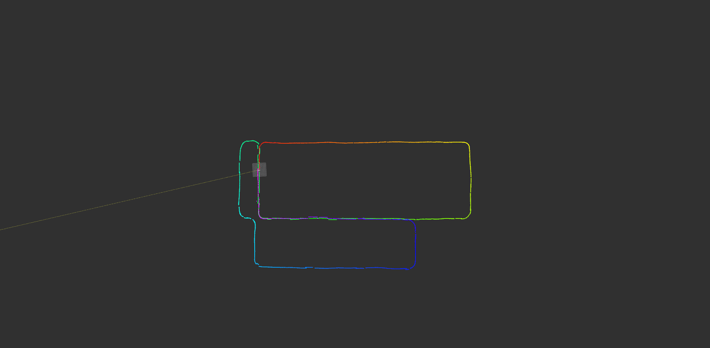
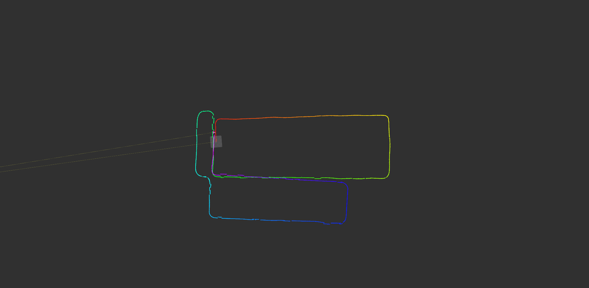

# NDT_MAP

## Introduction

参考 Autoware 的 ndt_mapping 和 lego_loam 的回环检测实现的建图包。NDT 和 lego_loam 原理见博客。

loop-closure enabled map cloud

loop-closure disabled map cloud

loop-closure enabled trajectory

loop-closure disabled trajectory


## Dependency

- [gtsam](https://github.com/borglab/gtsam/releases)(Georgia Tech Smoothing and Mapping library, 4.0.0-alpha2)
- [ndt_cpu](https://github.com/autowarefoundation/autoware/tree/master/ros/src/computing/perception/localization/lib/ndt_cpu)
- [ndt_gpu](https://github.com/autowarefoundation/autoware/tree/master/ros/src/computing/perception/localization/lib/ndt_gpu)

## Usage

### Input

- Point Cloud(`/lslidar_point_cloud`)
- Odometry(`/odom/imu`)
- Imu(`/imu/data`)
- TF: /base_link -> /laser, /odom -> /base_link(`/tf`)

### Output

- (`/laser_cloud_surround`)

### Run the package

1. Run the launch file:

```shell
roslaunch ndt_map test.launch
```

2. Play existing bag files [test_0515.bag](https://drive.google.com/file/d/1Y6KR9FUQggcyhvGsnkv7zpYQGvc7dQR_/view?usp=sharing):

```shell
rosbag play test_0515.bag --clock --topics
```

## Issues

- 线程安全
- 优化点云配准的初始估计
- 增加非里程计的初始估计（目前在 use_odom 设为 false 的情况下有问题）
- pitch 的累计误差导致高度漂移问题
- 目前位姿有抖动情况，尤其是 z 轴，还未检查问题（与定位时的抖动比较像，应该可以一起解决）

## TODOs

- 以`均值-协方差`格式存储/加载 NDT 地图
- 基于特征点的回环检测
- 添加 gpu 支持（在 ndt_gpu 库的基础上修改完成）
- 学习借鉴 Apollo NDT 定位的工程 trick

## Reference

1. [autowarefoundation/autoware](https://github.com/autowarefoundation/autoware)
2. [RobustFieldAutonomyLab/LeGO-LOAM](https://github.com/RobustFieldAutonomyLab/LeGO-LOAM)
3. [NDT 公式推导及源码解析（1）](https://blog.csdn.net/u013794793/article/details/89306901)